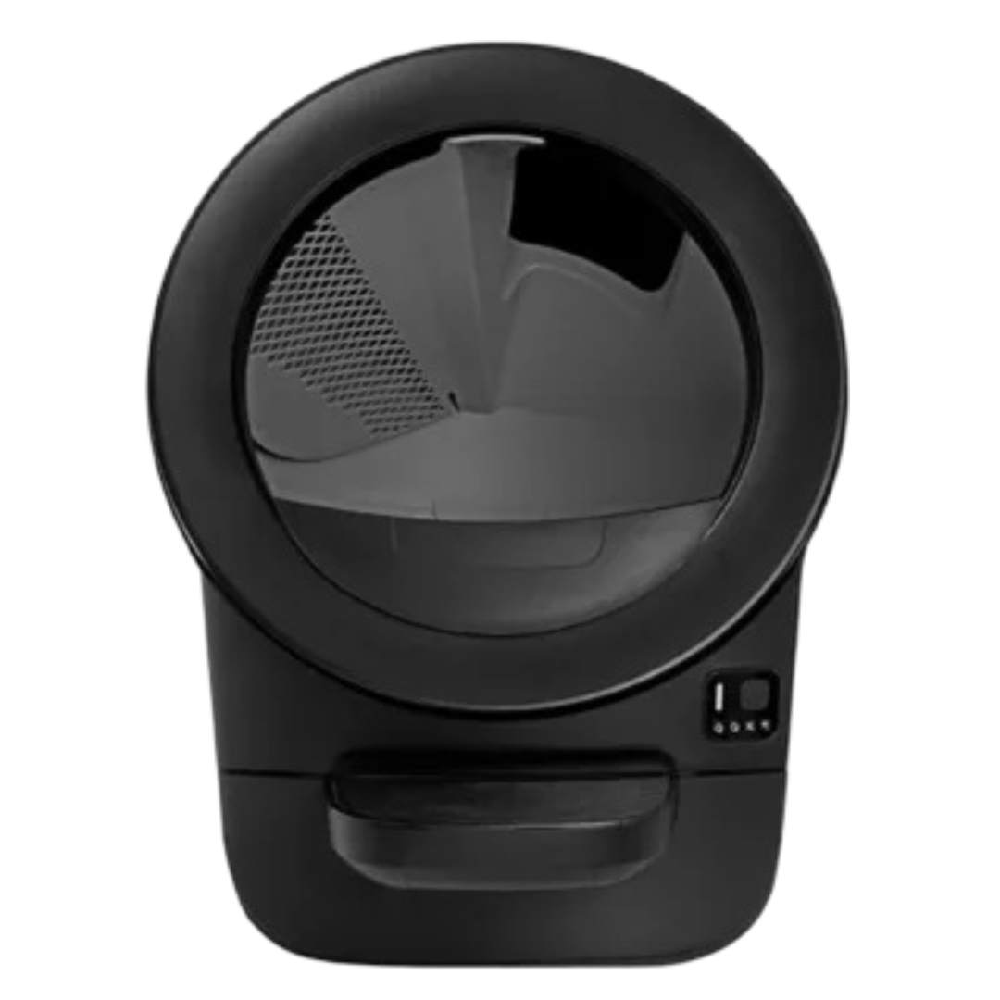

# Litter Robot Card

A custom Home Assistant Lovelace card for the Litter Robot integration.



## Features

- 🤖 Visual status indicator with animated glow effects
- 📊 Waste drawer level gauge (color-coded: green/yellow/red)
- 🐱 Litter level indicator
- 🐾 Cat info panel with weight and last visit
- 🎛️ Control buttons: Cycle, Reset, Light toggle
- 🌙 Dark mode compatible
- ⚙️ Visual editor support

## Installation

### HACS (Recommended)

1. Open HACS in Home Assistant
2. Go to "Frontend" section
3. Click the menu (three dots) → "Custom repositories"
4. Add `https://github.com/DevelopmentCats/litter-robot-card` as a Lovelace category
5. Search for "Litter Robot Card" and install
6. Refresh your browser

### Manual

1. Download `litter-robot-card.js` and `litter-robot.png` from the `dist` folder
2. Copy to `/config/www/community/litter-robot-card/`
3. Add resource in Lovelace:
   ```yaml
   resources:
     - url: /local/community/litter-robot-card/litter-robot-card.js
       type: module
   ```

## Configuration

### Basic

```yaml
type: custom:litter-robot-card
entity: vacuum.litter_robot_litter_box
cat_name: Whiskers
```

### With Cat Image

```yaml
type: custom:litter-robot-card
entity: vacuum.litter_robot_litter_box
cat_name: Whiskers
cat_image: /local/images/my-cat.jpg
```

### Advanced (Entity Overrides)

If your entities don't follow the standard naming convention:

```yaml
type: custom:litter-robot-card
entity: vacuum.poop_goblin_litter_box
cat_name: Carl
waste_drawer_entity: sensor.poop_goblin_waste_drawer
litter_level_entity: sensor.poop_goblin_litter_level
pet_weight_entity: sensor.poop_goblin_pet_weight
last_seen_entity: sensor.poop_goblin_last_seen
reset_button_entity: button.poop_goblin_reset
night_light_entity: light.poop_goblin_night_light
```

## Options

| Option | Type | Required | Default | Description |
|--------|------|----------|---------|-------------|
| `entity` | string | Yes | - | Litter Robot vacuum entity |
| `cat_name` | string | No | Cat | Your cat's name |
| `cat_image` | string | No | - | URL to cat photo |
| `robot_image` | string | No | Built-in | Custom robot image |
| `waste_drawer_entity` | string | No | Auto | Override waste drawer sensor |
| `litter_level_entity` | string | No | Auto | Override litter level sensor |
| `pet_weight_entity` | string | No | Auto | Override pet weight sensor |
| `last_seen_entity` | string | No | Auto | Override last seen sensor |
| `reset_button_entity` | string | No | Auto | Override reset button |
| `night_light_entity` | string | No | Auto | Override night light |

## Status Indicators

- 🟢 **Ready** - Robot is idle and ready
- 🔵 **Cleaning** - Robot is cycling (with pulsing glow)
- 🟡 **Cat Detected** - Cat is using the robot
- 🔴 **Error** - Check the robot (with pulsing glow)
- 🔴 **Offline** - Robot is unavailable

## Requirements

- Home Assistant with the [Litter Robot integration](https://www.home-assistant.io/integrations/litterrobot/)
- A Litter Robot (tested with Litter Robot 4)

## License

MIT
